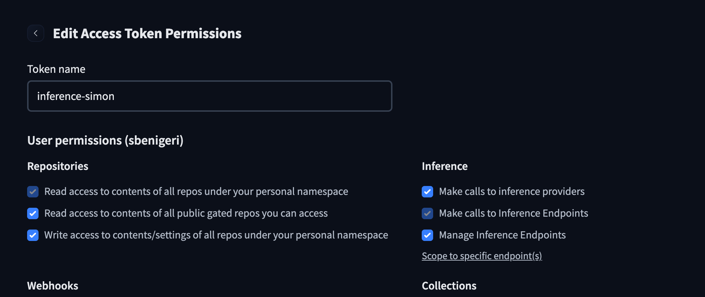
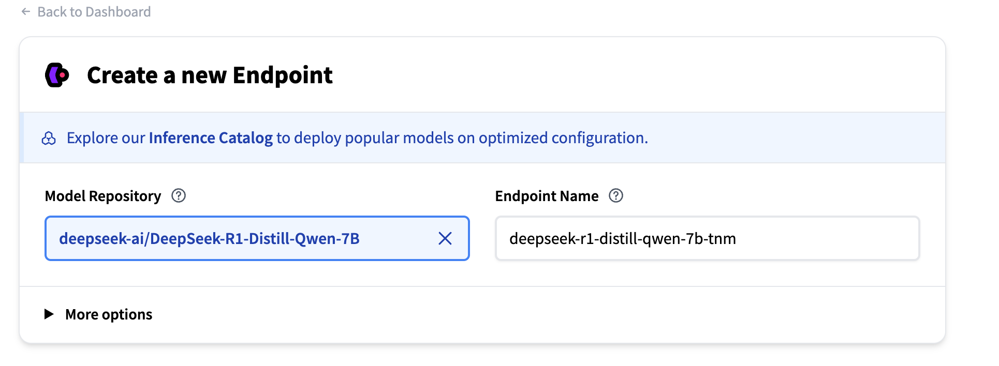
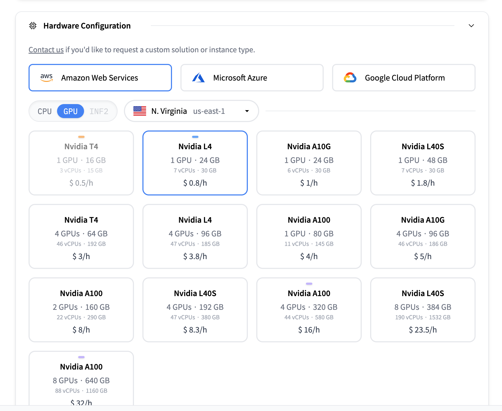
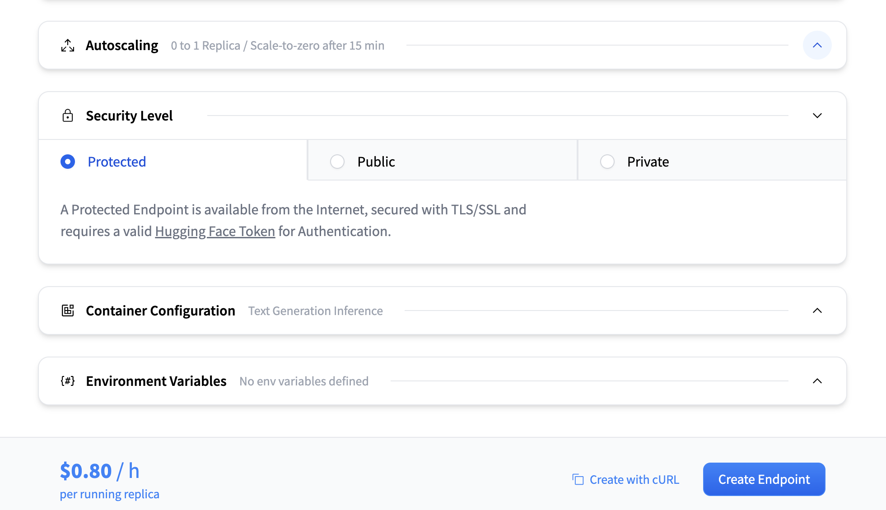

# 20 Questions Experiment Instructions

## Environment Setup

1. Clone the repository:
```bash
git clone https://github.com/c-col/LearningToAsk.git
cd 396_chris_eval
```

2. Create and activate conda environment:
```bash
conda create -n 20_qns python=3.11
conda activate 20_qns
```

3. Install dependencies:
```bash
pip install -r requirements.txt
```

## Experiment Matrix

### Model Variants
- DeepSeek R1 Distill Qwen 1.5B
- DeepSeek R1 Distill Qwen 7B
- DeepSeek R1 Distill Qwen 14B
- DeepSeek R1 Distill Qwen 32B

#### Model Endpoint Setup
Each model variant corresponds to a running endpoint on Huggingface's Inference API. Before running experiments:
1. Ensure the endpoint for your assigned model is running
2. Either:
   - Coordinate with Simon to use existing endpoints, or
   - Set up your own endpoints (recommended):
     1. Create an API token ([Token Creation Guide](https://huggingface.co/docs/hub/en/security-tokens))
        
        Required token permissions:
        
        - Under "Repositories": Read access to contents of all repos
        - Under "Inference": All three permissions (Make calls to inference providers, Make calls to Inference Endpoints, Manage Inference Endpoints)
     2. Create an endpoint ([Endpoint Creation Guide](https://huggingface.co/docs/inference-endpoints/en/guides/create_endpoint))
        
        Example endpoint configuration:
        
        - Select an appropriate instance type based on model size (Use the cheapest GPU that they recommend)
        
        - Enable auto-scaling to minimize costs
        
        - Set security level to "Protected" with token authentication
     3. Update tokenizer mapping in `ModelClient` class in file `model_client.py`:
        ```python
        tokenizer_dict = {
            # existing mappings
            "deepseek-r1-distill-qwen-1-5-vlc": "deepseek-ai/DeepSeek-R1-Distill-Qwen-1.5B",
            "deepseek-r1-distill-qwen-7b-mka": "deepseek-ai/DeepSeek-R1-Distill-Qwen-7B",
            "deepseek-r1-distill-qwen-14b-znu": "deepseek-ai/DeepSeek-R1-Distill-Qwen-14B",
            "deepseek-r1-distill-qwen-32b-ldr": "deepseek-ai/DeepSeek-R1-Distill-Qwen-32B",
            # add your endpoint:tokenizer map here
            "your-endpoint-name": "huggingface-org/original-model-name",
        }
        ```
        Map your endpoint name to the original model's tokenizer name.

3. The experiment will fail if the corresponding endpoint is not active

### Datasets
- `contrast_sets_8_celebs.json`: 8-entity celebrity sets (N=90, first 10 used)
- `contrast_sets_8_things.json`: 8-entity object sets (N=90, first 10 used)
- `contrast_sets_8.json`: General 8-entity sets (N=90, first 10 used)
- `contrast_sets_16.json`: 16-entity sets (N=90, first 10 used)
- `contrast_sets_bigbench.json`: BigBench-derived sets (N=29, first 10 used)

**Note**: For all datasets, we only run experiments on the first 10 examples to manage computational resources and time.

### Experiment Tracking

| Model | Dataset | Priority | Person Running | Progress |
|-------|---------|----------|----------------|----------|
| DeepSeek R1 Distill Qwen 7B (MKA) | contrast_sets_8.json | high | Simon | Done |
| DeepSeek R1 Distill Qwen 7B (MKA) | contrast_sets_16.json | high | Simon | Started |
| DeepSeek R1 Distill Qwen 7B (MKA) | contrast_sets_bigbench.json | high | Shubham | ? |
| DeepSeek R1 Distill Qwen 32B (LDR) | contrast_sets_8.json | high | Simon | Done |
| DeepSeek R1 Distill Qwen 32B (LDR) | contrast_sets_16.json | high | Chris | ? |
| DeepSeek R1 Distill Qwen 32B (LDR) | contrast_sets_bigbench.json | high | TBD | ? |

<!-- | Model | Dataset | Priority | Person Running |
|-------|---------|----------|----------------|
| DeepSeek R1 Distill Qwen 1.5B (VLC) | contrast_sets_8_celebs.json | TBD | TBD |
| DeepSeek R1 Distill Qwen 1.5B (VLC) | contrast_sets_8_things.json | low | Simon |
| DeepSeek R1 Distill Qwen 1.5B (VLC) | contrast_sets_8.json | low | Simon |
| DeepSeek R1 Distill Qwen 1.5B (VLC) | contrast_sets_16.json | low | Chris |
| DeepSeek R1 Distill Qwen 1.5B (VLC) | contrast_sets_bigbench.json | low | Shubham |
| DeepSeek R1 Distill Qwen 7B (MKA) | contrast_sets_8_celebs.json | TBD | TBD |
| DeepSeek R1 Distill Qwen 7B (MKA) | contrast_sets_8_things.json | low | Simon |
| DeepSeek R1 Distill Qwen 7B (MKA) | contrast_sets_8.json | high | Simon |
| DeepSeek R1 Distill Qwen 7B (MKA) | contrast_sets_16.json | high | Simon |
| DeepSeek R1 Distill Qwen 7B (MKA) | contrast_sets_bigbench.json | high | Shubham |
| DeepSeek R1 Distill Qwen 14B (ZNU) | contrast_sets_8_celebs.json | TBD | TBD |
| DeepSeek R1 Distill Qwen 14B (ZNU) | contrast_sets_8_things.json | low | Simon |
| DeepSeek R1 Distill Qwen 14B (ZNU) | contrast_sets_8.json | low | Simon |
| DeepSeek R1 Distill Qwen 14B (ZNU) | contrast_sets_16.json | low | Chris |
| DeepSeek R1 Distill Qwen 14B (ZNU) | contrast_sets_bigbench.json | low | Shubham |
| DeepSeek R1 Distill Qwen 32B (LDR) | contrast_sets_8_celebs.json | TBD | TBD |
| DeepSeek R1 Distill Qwen 32B (LDR) | contrast_sets_8_things.json | low | Simon |
| DeepSeek R1 Distill Qwen 32B (LDR) | contrast_sets_8.json | high | Simon |
| DeepSeek R1 Distill Qwen 32B (LDR) | contrast_sets_16.json | high | Chris |
| DeepSeek R1 Distill Qwen 32B (LDR) | contrast_sets_bigbench.json | high | TBD | --> 

## Running Experiments

### Base Command Format
```bash
python play_20qns_api.py -g <model-endpoint> -gpe -gt r1 --dataset-path "../data/game_sets/test/<dataset-file>" --token-path <path-to-hf-inference-api-token> --token-path-judge <path-to-hf-inference-judge-token>
```
⚠️ **WARNING**: Make sure all commands below have your token path.

⚠️ **WARNING**: If you create your own endpoint, make sure to use YOUR endpoint name in the `-g` argument, not the original model name. The endpoint name must match exactly what you added to the `tokenizer_dict` in `model_client.py`. For example:
- ❌ `-g deepseek-ai/DeepSeek-R1-Distill-Qwen-1.5B`  (wrong: original model name)
- ❌ `-g deepseek-r1-distill-qwen-1-5-xyz`  (wrong: someone else's endpoint name)
- ✅ `-g deepseek-r1-distill-qwen-1-5-vlc`  (correct: my endpoint name)

### Experiment Commands

#### 1.5B Model (VLC)
```bash
# Celebrities dataset
python play_20qns_api.py -g deepseek-r1-distill-qwen-1-5-vlc -gpe -gt r1 --dataset-path "../data/game_sets/test/contrast_sets_8_celebs.json"

# Objects dataset
python play_20qns_api.py -g deepseek-r1-distill-qwen-1-5-vlc -gpe -gt r1 --dataset-path "../data/game_sets/test/contrast_sets_8_things.json"

# General 8-entity dataset
python play_20qns_api.py -g deepseek-r1-distill-qwen-1-5-vlc -gpe -gt r1 --dataset-path "../data/game_sets/test/contrast_sets_8.json"

# 16-entity dataset
python play_20qns_api.py -g deepseek-r1-distill-qwen-1-5-vlc -gpe -gt r1 --dataset-path "../data/game_sets/test/contrast_sets_16.json"

# BigBench dataset
python play_20qns_api.py -g deepseek-r1-distill-qwen-1-5-vlc -gpe -gt r1 --dataset-path "../data/game_sets/test/contrast_sets_bigbench.json"
```

#### 7B Model (MKA)
```bash
# Celebrities dataset
python play_20qns_api.py -g deepseek-r1-distill-qwen-7b-mka -gpe -gt r1 --dataset-path "../data/game_sets/test/contrast_sets_8_celebs.json"

# Objects dataset
python play_20qns_api.py -g deepseek-r1-distill-qwen-7b-mka -gpe -gt r1 --dataset-path "../data/game_sets/test/contrast_sets_8_things.json"

# General 8-entity dataset
python play_20qns_api.py -g deepseek-r1-distill-qwen-7b-mka -gpe -gt r1 --dataset-path "../data/game_sets/test/contrast_sets_8.json"

# 16-entity dataset
python play_20qns_api.py -g deepseek-r1-distill-qwen-7b-mka -gpe -gt r1 --dataset-path "../data/game_sets/test/contrast_sets_16.json"

# BigBench dataset
python play_20qns_api.py -g deepseek-r1-distill-qwen-7b-mka -gpe -gt r1 --dataset-path "../data/game_sets/test/contrast_sets_bigbench.json"
```

#### 14B Model (ZNU)
```bash
# Celebrities dataset
python play_20qns_api.py -g deepseek-r1-distill-qwen-14b-znu -gpe -gt r1 --dataset-path "../data/game_sets/test/contrast_sets_8_celebs.json"

# Objects dataset
python play_20qns_api.py -g deepseek-r1-distill-qwen-14b-znu -gpe -gt r1 --dataset-path "../data/game_sets/test/contrast_sets_8_things.json"

# General 8-entity dataset
python play_20qns_api.py -g deepseek-r1-distill-qwen-14b-znu -gpe -gt r1 --dataset-path "../data/game_sets/test/contrast_sets_8.json"

# 16-entity dataset
python play_20qns_api.py -g deepseek-r1-distill-qwen-14b-znu -gpe -gt r1 --dataset-path "../data/game_sets/test/contrast_sets_16.json"

# BigBench dataset
python play_20qns_api.py -g deepseek-r1-distill-qwen-14b-znu -gpe -gt r1 --dataset-path "../data/game_sets/test/contrast_sets_bigbench.json"
```

#### 32B Model (LDR)
```bash
# Celebrities dataset
python play_20qns_api.py -g deepseek-r1-distill-qwen-32b-ldr -gpe -gt r1 --dataset-path "../data/game_sets/test/contrast_sets_8_celebs.json"

# Objects dataset
python play_20qns_api.py -g deepseek-r1-distill-qwen-32b-ldr -gpe -gt r1 --dataset-path "../data/game_sets/test/contrast_sets_8_things.json"

# General 8-entity dataset
python play_20qns_api.py -g deepseek-r1-distill-qwen-32b-ldr -gpe -gt r1 --dataset-path "../data/game_sets/test/contrast_sets_8.json"

# 16-entity dataset
python play_20qns_api.py -g deepseek-r1-distill-qwen-32b-ldr -gpe -gt r1 --dataset-path "../data/game_sets/test/contrast_sets_16.json"

# BigBench dataset
python play_20qns_api.py -g deepseek-r1-distill-qwen-32b-ldr -gpe -gt r1 --dataset-path "../data/game_sets/test/contrast_sets_bigbench.json"
```

## Output Structure
Results will be saved in:
```
data/game_sets/test/outputs/results__<dataset>__<model>/
├── checkpoints/      # Individual game results
│   ├── game_0.json
│   ├── game_1.json
│   └── ...
└── game_results.json # Combined results and config
```
Note that checkpoints are in the `.gitignore` so they will stay local.

