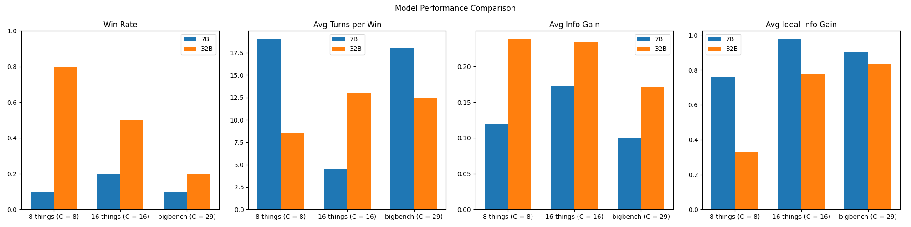

# 20 Questions Model Performance Analysis

This report analyzes the performance of two language models (7B and 32B parameters) on the 20 questions game across different dataset complexities.

## Overview

We compare two models:
- 7B parameters (DeepSeek-R1-Distill-Qwen-7B)
- 32B parameters (DeepSeek-R1-Distill-Qwen-32B)

on two datasets:
- 8 things (C = 8): Simple dataset with 8 possible entities
- 16 things (C = 16): More complex dataset with 16 possible entities

## Model Comparison

### Performance on 8 Things Dataset

#### 7B Model
- Win Rate: 10.00%
- Average Turns per Win: 19.0
- Average Information Gain: 0.119
- Ideal Information Gain: 0.758
- Information Gain Efficiency: 15.7% of ideal

.png)

#### 32B Model
- Win Rate: 80.00%
- Average Turns per Win: 8.5
- Average Information Gain: 0.238
- Ideal Information Gain: 0.332
- Information Gain Efficiency: 71.7% of ideal

.png)

### Performance on 16 Things Dataset

#### 7B Model
- Win Rate: 20.00%
- Average Turns per Win: 4.5
- Average Information Gain: 0.173
- Ideal Information Gain: 0.976
- Information Gain Efficiency: 17.7% of ideal

.png)

#### 32B Model
- Win Rate: 50.00%
- Average Turns per Win: 13.0
- Average Information Gain: 0.234
- Ideal Information Gain: 0.776
- Information Gain Efficiency: 30.2% of ideal

.png)

## Key Findings

1. **Model Size Impact**:
   - The 32B model significantly outperforms the 7B model across all metrics
   - Most notable on the simpler dataset (8 things) where 32B achieves 80% win rate vs 10% for 7B
   - 32B consistently achieves higher information gain (0.238 vs 0.119 on 8 things)

2. **Dataset Complexity Impact**:
   - 32B model's win rate drops from 80% to 50% when moving from 8 to 16 things
   - 7B model shows slight improvement in win rate (10% to 20%) but may be due to small sample size
   - Average information gain increases slightly for both models with dataset complexity

3. **Information Gain Patterns**:
   - 32B model maintains higher average information gain across both datasets
   - On 8 things: 32B achieves 0.238 vs 7B's 0.119
   - On 16 things: 32B achieves 0.234 vs 7B's 0.173
   - Both models show more consistent information gain on the larger dataset

4. **Turns to Win**:
   <!-- - 32B model generally needs fewer turns to win when it succeeds
   - On 8 things dataset: 32B averages 8.5 turns vs 19.0 for 7B
   - Exception in 16 things dataset where patterns are less clear, possibly due to the single win for the 7B model -->
   - TODO